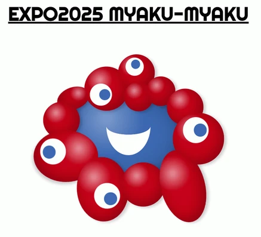

# MyakuMyaku - EXPO2025 Official Character built with HTML/CSS/JS

HTML・CSS・JavaScript だけで作成したミャクミャクのキャラクターです。  
目がマウスカーソルに追従して動き、身体は複数の球体で構成されています。

## 🔍 Live Demo on CodePen

📎 [https://codepen.io/Naoki-Takeshita/pen/LEVaXQZ](https://codepen.io/Naoki-Takeshita/pen/LEVaXQZ)

---

この作品は、2025 年大阪・関西万博の公式キャラクター「ミャクミャク」の二次創作です。  
博覧会協会の「二次創作ガイドライン」に従い、非営利目的で公開しています。

This is a derivative fan work based on "MyakuMyaku", the official character of Expo 2025 Osaka, Kansai, Japan.  
It is created and published in accordance with the Expo Association's guidelines for fan-made works, and is not intended for commercial or promotional use.
